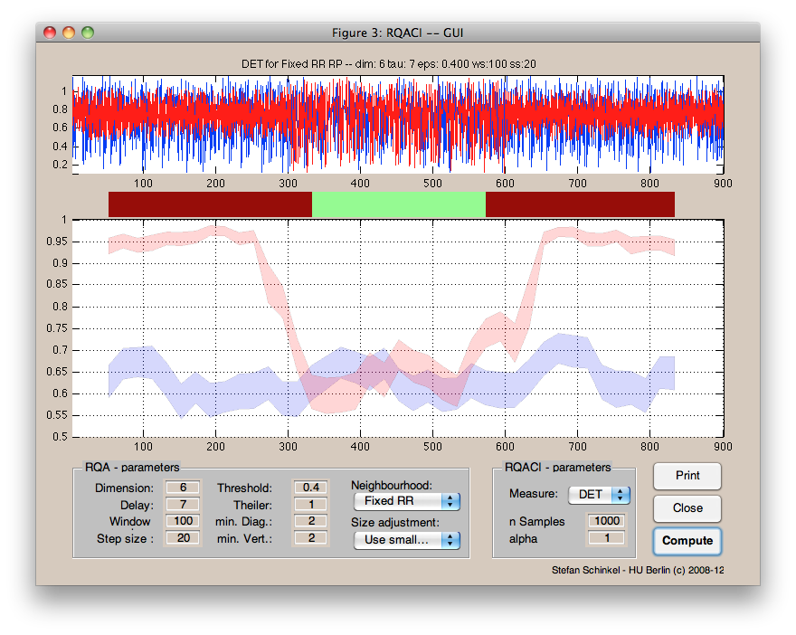

##rqaci - confidence bounds of RQA measures

###About:

`rqaci` is a set of routines to estimate the confindence bounds of recurrence-based comlexity measures. It comes with a simple GUI for convenience.

If you use this software for data analysis and publication please cite:
S. Schinkel, N. Marwan, O. Dimigen and J. Kurths (2009) *Confidence bounds of recurrence-based complexity measures*, [Physics Letters A](www.elsevier.com/locate/pla), 373(26), pp. 2245-2250. [DOI:10.1016/j.physleta.2009.04.045](http://dx.doi.org/10.1016/j.physleta.2009.04.045)

###Contents:

  * rqaci.m - The core routine
  * lineDists.m - function to extract lines structures from RPs
  * bootstrap.m - function to bootstrap a distribution
  * ciplot.m - routine for plot confidence intervals
  * cicompare.m - routine for comparing overlap confidence intervals
  * rqaciGUI.m - graphical frontend (GUI) to rqaci
  * rqaciGUILayout.m - layout of the GUI
  * prctile.m - stand-in function for percentile estimation

###Requirements:

  * MATLAB (tested on  2007, 2010a and 2010b so any recent version should do)
  * the [CRPtoolbox](http://tocsy.pik-potsdam.de/CRPtoolbox/)  -- unless you construct [J|C]RPs yourself
  * a function to estimate percentiles -- either from the Statistics Toolbox of MATLAB or use the stand-in provided

### Example

As a prototypical usage example we will use the logistic map for different parameters. To compute the logistic map, save the function below so that it is accessible for MATLAB.

```matlab
function out = logistic(varargin)

% get params
varargin{4} =[];
if ~isempty(varargin{1}), x0=varargin{1};else x0=rand;end
if ~isempty(varargin{2}), a=varargin{2};else a=3.5;end
if ~isempty(varargin{3}), n=varargin{3};else n=100;end

out = zeros( n, 1 );
out(1) = x0;
for i = 1:n-1
  out(i+1) = a*out(i)*(1-out(i));
end
```

Now we compute the logistic map for 2 cases:
Random (x) and periodic with a random part (y). The transients are removed.

```matlab
% random case
x = logistic(rand(1),3.89,5000);
x = x(end-900+1:end);

% transition case
y1 = logistic(rand(1),3.40,5000); % periodic
y2 = logistic(rand(1),3.89,5000); % random
y3 = logistic(rand(1),3.40,5000); % periodic

% concat segments
y = cat(1, y1(end-300+1:end),y2(end-300+1:end),y3(end-300+1:end));

% and add some noise
y = y + rand(size(y)) * .2;
x = x + rand(size(x)) * .2;
```

Plot the data just to have a look at it

```matlab
subplot(2,1,1);
plot(y,'r');
subplot(2,1,2);
plot(x,'b');
```

Setup parameters and compute RPs in a windowed fashion and estimate complexity measures and their confindence intervals for each window.

```matlab
tau = 7;
dim = 6;
tresh = .4;
norm = 'rr'; % fixed recurrence rate
win = 100;
step = 10;

for iFrame = 1:step:length(x)-win
  rpX = crp(x(iFrame:iFrame+win),dim,tau,thresh,norm,'sil');
  rpY = crp(y(iFrame:iFrame+win),dim,tau,thresh,norm,'sil');
  [valX(iFrame,:) ciX(iFrame,:,:)] = rqaci(rpX,750,1);
  [valY(iFrame,:) ciY(iFrame,:,:)] = rqaci(rpY,750,1);
end
```

Now plot the confidence intervals

```matlab
figure;
ciplot(ciX(1:step:end,1,:),'b')
ciplot(ciY(1:step:end,1,:),'r')
```

For convenience and to get a feel for the parameters, this can be done using the GUI by calling (see screenshot)

```matlab
rqaciGUI(x,y)
```

###screenshot
The screenshot shows the data constructed above.



